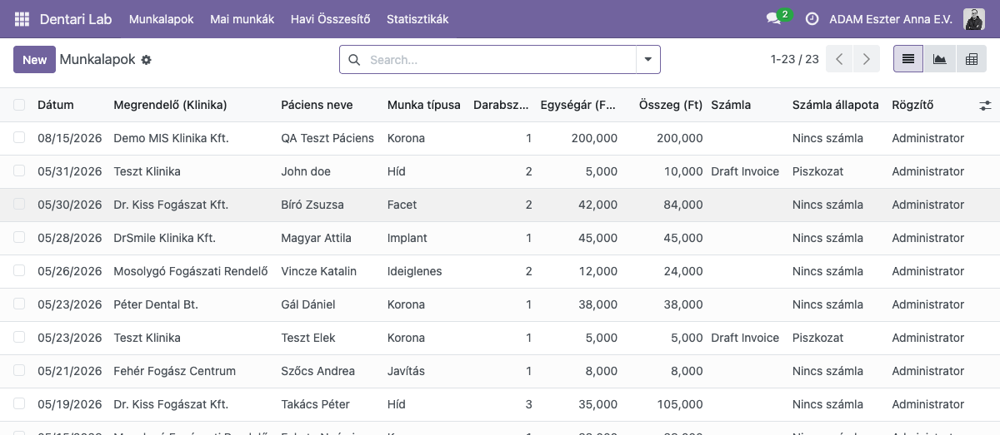
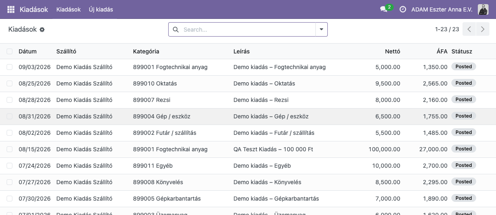
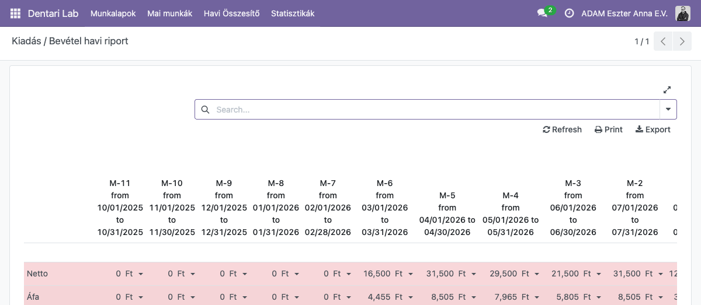

# DentariOdoo

> **Custom Odoo 18 module suite for dental laboratory operations.**  
> Invoice-ready, multi-clinic, audit-logged — self-hosted via Docker Compose.

---

## Overview

DentariOdoo is a custom **Odoo 18** module suite for a dental laboratory. Three installable addons:

| Module | Purpose |
|--------|---------|
| `dentari_lab` | Work sheet tracking (`dental.work.log`), monthly invoicing wizard, monthly email digest |
| `dental_quick_expense` | Lightweight expense-recording wizard over Vendor Bills, 11 expense categories |
| `dentari_mis_reports` | Rolling 12-month Kiadás/Bevétel (expense/revenue) profitability report, built on `mis_builder` |

| Capability | How |
|------------|-----|
| Work sheet management | `dentari_lab` — `dental.work.log` model |
| Role-based access | Lab Technician / Lab Manager security groups |
| Audit trail | `mail.thread` field-level change tracking |
| Invoicing | `account.move` bridge |
| Multi-clinic | Partner-based clinic separation |
| Monthly email digest | `dentari_lab` digest wizard + templates |
| Quick expense entry | `dental_quick_expense` wizard → draft Vendor Bill |
| Kiadás/Bevétel reporting | `dentari_mis_reports` — rolling 12-month `mis.report.instance`, colorized report rows, per-column date ranges, "Statisztikák" menu |
| Dev-only QA dashboard | Round-number demo data + smoke test for report verification |

**Current status:** `dentari_lab`, `dental_quick_expense`, and `dentari_mis_reports` all installable and deployed.

**Screenshots** (dev environment, demo data):

| `dentari_lab` — Munkalapok | `dental_quick_expense` — Kiadások | `dentari_mis_reports` — Kiadás/Bevétel |
|:---:|:---:|:---:|
|  |  |  |

---

## Docs

| Document | Purpose |
|----------|---------|
| [docs/DESIGN.md](docs/DESIGN.md) | Full system design — data model, security, views, decisions log |
| [docs/DEPLOY.md](docs/DEPLOY.md) | Infrastructure & deployment reference — Docker Compose, backups, monitoring |
| [docs/TESTING.md](docs/TESTING.md) | Test setup and running tests |
| [docs/PROJECT-ANALYSIS.md](docs/PROJECT-ANALYSIS.md) | Project analysis notes |
| [docs/dental_quick_expense-spike-findings.md](docs/dental_quick_expense-spike-findings.md) | Dental Quick Expense Phase 0 spike findings |
| [docs/superpowers/specs/2026-06-12-monthly-email-design.md](docs/superpowers/specs/2026-06-12-monthly-email-design.md) | Monthly email digest — design spec |
| [docs/superpowers/plans/2026-06-12-monthly-email.md](docs/superpowers/plans/2026-06-12-monthly-email.md) | Monthly email digest — implementation plan |
| [docs/superpowers/specs/2026-09-02-dental-quick-expense-design.md](docs/superpowers/specs/2026-09-02-dental-quick-expense-design.md) | Dental Quick Expense — design spec |
| [docs/superpowers/plans/2026-09-02-dental-quick-expense.md](docs/superpowers/plans/2026-09-02-dental-quick-expense.md) | Dental Quick Expense — implementation plan |
| [docs/superpowers/specs/2026-09-03-mis-builder-reports-design.md](docs/superpowers/specs/2026-09-03-mis-builder-reports-design.md) | MIS builder (Kiadás/Bevétel) reports — design spec |
| [docs/superpowers/plans/2026-09-03-mis-builder-reports.md](docs/superpowers/plans/2026-09-03-mis-builder-reports.md) | MIS builder (Kiadás/Bevétel) reports — implementation plan |

---

## Development

This project ships via **oec.sh**. Ticket work → deploy → live verify follow the
`odoo-oecsh-ticket-deploy` skill (`~/.claude/skills/odoo-oecsh-ticket-deploy/SKILL.md`):
code change → push → oec.sh redeploy → Odoo dev-mode + module upgrade → Playwright
screenshot → issue-tracker comment. Covers oec.sh API endpoints, apps-upgrade UI gotcha,
Playwright session gotcha, credentials reference. Use it for any ticket that needs to land
on a real environment and be verified live, not just committed.
